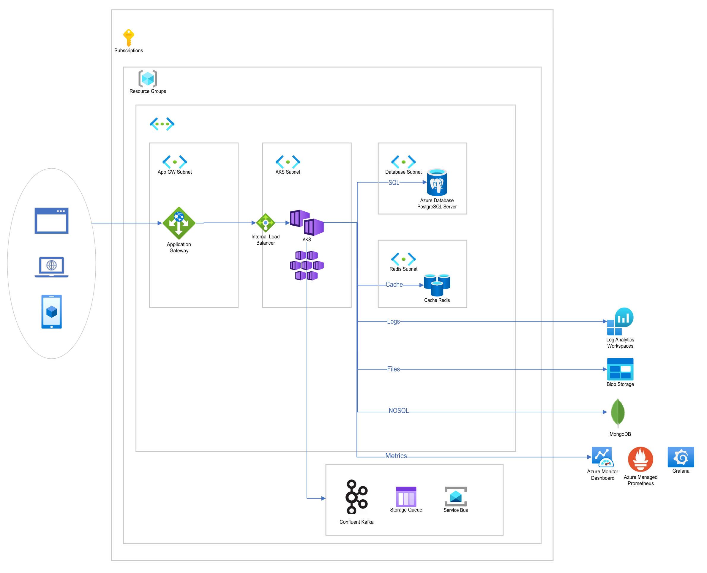

# az-demo-fn



## Prerequisites

* Azure CLI version 2.47.0 or later
* kubectl

## Getting started

### Create parameters.json

```bash
cat <<EOF > parameters.json
{
    "postgresServerAdminPassword": { "value": "A$(openssl rand -hex 6)#" }
}
EOF
```

### Deploy Resources to Azure

```bash
resourceGroupName="rg-aks-demo-freenow-001"
location="northeurope"
deploymentName="aks-demo-freenow-001"

# create a resource group
az group create -n $resourceGroupName -l $location

# modify the template as needed
az deployment group create \
        -g $resourceGroupName \
        -n $deploymentName \
        --template-file main.bicep \
        --parameters parameters.json
```

### Enable / disable private AKS cluster

[Link to documentation](https://learn.microsoft.com/en-US/azure/aks/api-server-vnet-integration#enable-or-disable-private-cluster-mode-on-an-existing-cluster-with-api-server-vnet-integration)

```bash
# Install the aks-preview extension
az extension add --name aks-preview

# Update the extension to make sure you have the latest version installed
az extension update --name aks-preview

# Register the EnableAPIServerVnetIntegrationPreview feature flag using the az feature register command.
az feature register --namespace "Microsoft.ContainerService" --name "EnableAPIServerVnetIntegrationPreview"
# Verify the registration status using the az feature show command - this may take some time
az feature show --namespace "Microsoft.ContainerService" --name "EnableAPIServerVnetIntegrationPreview"
# Re-register the provider
az provider register --namespace Microsoft.ContainerService

# Enable private cluster mode
az aks update -n <cluster-name> \
    -g <resource-group> \
    --enable-private-cluster
```

### Adding a node pool to the cluster
```bash
# Update these values so that they match the actual deployed resources
resourceGroupName="rg-aks-demo-freenow-001"
clusterName="freenow1234-cluster"
nodePoolName="nodepool2"

deploymentName="aks-demo-$nodePoolName-freenow-001"

az deployment group create \
  --name $deploymentName \
  --resource-group $resourceGroupName \
  --template-file ./aks/modules/nodepool.bicep \
  --parameters clusterName="$clusterName" nodePoolName="$nodePoolName"
```
