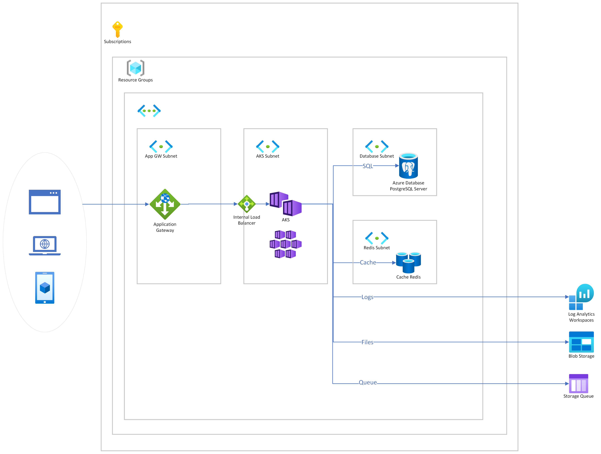

# az-demo-fn



## Prerequisites

* Azure CLI version 2.47.0 or later
* kubectl
* Helm version 3.0 or later
* jq

Following the following tutorials:

* [AKS + Application Gateway (excluding Application Gateway Ingress Controller parts)](https://learn.microsoft.com/en-us/azure/application-gateway/ingress-controller-install-new)
* [Ingress Web Application Routing](https://learn.microsoft.com/en-us/azure/aks/web-app-routing?tabs=without-osm)

## Getting started

### Create parameters.json

```bash
cat <<EOF > parameters.json
{
    "postgresServerAdminPassword": { "value": "A$(openssl rand -hex 6)#" }
}
EOF
```

### Deploy Resources to Azure

```bash
resourceGroupName="rg-aks-demo-freenow-001"
location="northeurope"
deploymentName="aks-demo-freenow-001"

# create a resource group
az group create -n $resourceGroupName -l $location

# modify the template as needed
az deployment group create \
        -g $resourceGroupName \
        -n $deploymentName \
        --template-file main.bicep \
        --parameters parameters.json
```

### TODOs

* ~~Application Gateway with one Backend Pool pointing to AKS Ingress Controller~~
* AKS Api Server VNET integration
* ~~Azure AD Pod Identity~~
* ~~Postgres Flexible Server~~
* ~~Storage Account~~
* ~~Redis Cache~~
* ~~Container Registry~~
* ~~Log Analytics Workspace~~
* ~~AKS KEDA Addon~~
